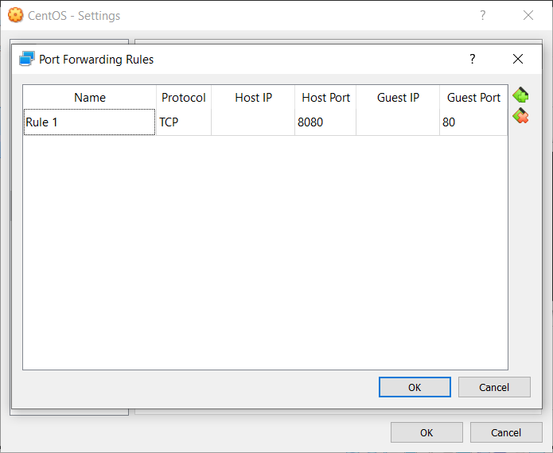

# Park CentOS Setup

## Introduction

Like we stated in the README, due to architecture, security requirements, cross-lot tracking, etc., NASA's version of LaRC Park was a bit complex, running on multiple separate Red Hat Linux servers using Apache or MySQL. However, you can recreate it on any system; for our demo, we used the following setup:

- Oracle VirtualBox Virtual Machine (VM) Manager(using 6.0.6)
- CentOS Linux 7 (using 3.10.0-957.e17.x86_84)
- cron Time-Based Job Scheduler (using cronie-1.4.11-19.e17.x86_64)
- SQLite Relational Database Management System (RDBMS) (using 3.7.17)
- GNOME Desktop Version 3.28.2
- Python 3 Programming Language Interpreter (using version 3.6.8)
- Extra Packages for Enterprise Linux (EPEL) (using epel-release-7-11.noarch)
- Nginx Hypertext Transfer Protocol (HTTP) Web Server (using nginx.x86_64 1:1.16.1-1.e17)
- PHP Hypertext Preprocessor (using version 5.4.16) with Zend Engine Interpreter (using version 2.4.0)

This setup will allow you to implement the stack shown below. Have fun and good luck!

----------

## Setup

As we just said, we'll be using CentOS Linux 7 in VirtualBox for this demo, but you can use another virtual machine or an actual server if you like. Just make sure that your system has at least 2GB of memory; 16GB of hard disk space; 128MB of video memory; and a connection to the Internet.

We'll be using the default minimal install option. Since our focus is on getting Park up and running, we won't get into creating a CentOS VM in VirtualBox. Several online walkthroughs exist:  [Kurt Bando's tutorial](https://tutorials.kurtobando.com/install-a-centos-7-minimal-server-in-virtual-machine-with-screenshots/ "Install a CentOS 7 Minimal Server in Virtual Machine with screenshots")  is an excellent walkthrough.

Once your VM is setup, and to start things off right, let's create a super user to avoid using the root user:

    [root@localhost ~]# adduser park
    [root@localhost ~]# passwd park
    Changing password for user park.
    New password: ********
    Retype new password: ********
    passwd: all authentication tokens updated successfully.
    [root@localhost ~]# gpasswd -a park wheel
    Adding user park to group wheel
    [root@localhost ~]# su - park
    [park@localhost ~]$

If you want to connect to the Internet using an existing WiFi access point, instead of an ethernet cable, use the Network Manager Text User Interface (nmtuui):

    $ chkconfig NetworkManager on
    $ service NetworkManager start
    $ nmtui

The TUI should appear. Select "Activate a Connection" and find your AP. Enter your password; you should then be connected.

Next, update the system and add CentOS' development tools using the following commands in the CLI:

    [park@localhost ~]$ sudo yum -y update
    [park@localhost ~]$ sudo yum -y install yum-utils
    [park@localhost ~]$ sudo yum -y groupinstall development

This may take a while, especially on a new system.

Once the system update is completed, make sure that we have everything we need:

1. **cron Time-Based Job Scheduler**  - cron should be already installed, but check anyway:

        [park@localhost ~]$ whereis -b crontab | cut -d' ' -f2 | xargs rpm -qf
        cronie-1.4.11-19.e17.x86_64

    If cron is not installed, install it using the following command:

        [park@localhost ~]$ yum -y install cronie

2. **SQLite RDBMS**  - SQLite should also be installed, but check anyway:

        [park@localhost ~]$ sqlite3 -version
        3.7.17 2013-05-20 00:56:22 118a3b35693b134d56ebd780123b7fd6f1497668

    If SQLite is not installed, install it using the following command:

        [park@localhost ~]$ sudo yum -y install sqlite

3. **Nginx HTTP Web Server**  - To use Nginx, install the  [Extra Packages for Enterprise Linux (EPEL)](https://fedoraproject.org/wiki/EPEL "Extra Packages for Enterprise Linux (EPEL)")  first:

        [park@localhost ~]$ sudo yum -y install epel-release

    Once the installation is completed, install Nginx:

        [park@localhost ~]$ sudo yum -y install nginx

    Once Nginx is installed, start the server. In addition, run the second command so that Nginx automatically starts when the system boots up:

        [park@localhost ~]$ sudo systemctl start nginx
        [park@localhost ~]$ sudo systemctl enable nginx
        Created symlink from /etc/systemd/system/multi-user.target.wants/nginx.service to /usr/lib/systemd/system/nginx.service.

    Once the server is started, we have several ways to access the web server:

    - Method #1: Open a browser in the VM - This is the easiest way, but we won't be able to access the site remotely. Install and start a desktop GUI, such as GNOME, using the following commands:

            sudo yum -y groupinstall "GNOME Desktop"
            sudo startx

        Once the desktop appears, open a browser and navigate to localhost ([http://127.0.0.1](http://127.0.0.1/)) and the Welcome page should appear:

        

    - Method #2: Access the web server through the VM host's browser - This method allows us to "test" the web server over a an actual connection, even though everything occurs on the VM's host computer.

        First, shutdown the VM and access the network settings:

        

        Click on  **Port Forwarding**. Set the Host Port to 8080 and the Guest Port to 80; click on  **OK**  when you are done:

        

        Restart the VM and enter the following commands:

            sudo firewall-cmd --zone=public --add-service=http --permanent
            sudo firewall-cmd --reload

        Open a browser on the host machine, navigate to  [http://127.0.0.1:8080](http://127.0.0.1:8080/), and the Welcome page should appear:

        

    - Method #3: If you are using an actual server, you can access it by entering its public IP address. Pull up the network interfaces using the following command:

            ip addr

        The first network interface name should be localhost, while the following name, which has the attributes <BROADCAST,MULTICAST,UP,LOWER_UP>, should be the name of the public address. Navigate to the INET IP address in a browser, and the Welcome page should appear.

4. **PHP Hypertext Preprocessor**  - We'll be using PHP as the intermediary between the front and back ends. To install PHP, run the following command:

        [park@localhost ~]$ sudo yum -y install php php-fpm

5. **Python 3 Programming Language Interpreter**  - While Python 2 is installed with CentOS by default, we will need Python 3 to run our computer vision and machine learning scripts, specifically Python 3.6.x. There are a few ways of doing this, but we will use the IUS Community Repo; for an in-depth look at options, check out  [this link from James Hogarth](https://www.hogarthuk.com/?q=node/15 "Running newer applications on CentOS"). To install Python, run the following command:

        [park@localhost ~]$ sudo yum -y install https://centos7.iuscommunity.org/ius-release.rpm
        [park@localhost ~]$ sudo yum -y install python36u
        [park@localhost ~]$ sudo yum -y install python36u-pip
        [park@localhost ~]$ sudo yum -y install python36u-devel

Alright! Before continuing, let's do another update of the system using the following command:

    [park@localhost ~]$ sudo yum -y update

Just in case, we'll double check everything is installed and updated using the following commands:

    [park@localhost ~]$ whereis -b crontab | cut -d' ' -f2 | xargs rpm -qf
    [park@localhost ~]$ sqlite3 -version
    [park@localhost ~]$ nginx -v
    [park@localhost ~]$ php -v
    [park@localhost ~]$ python3 ––version
    [park@localhost ~]$ pip3 ––version

One last thing: Using VirtualBox Guest Additions is not necessary, but it will make our life easier (e.g., cut and paste, etc.). Complete the following steps:

With the VM running...

1. Click on "Devices" on the VM menu bar
2. Click on the "Insert Guest Additions CD image..." option (If you get an error, you may have already inserted the disk).

In the terminal, enter the following commands (comments following [#] are not required):

    [park@localhost ~]$ sudo yum -y install make gcc kernel-headers kernel-devel perl dkms bzip2 # Installs all requirements
    [park@localhost ~]$ sudo export KERN_DIR=/usr/src/kernels/$(uname -r) # set and export the location of the kernel source code
    [park@localhost ~]$ sudo mount -r /dev/cdrom /media
    [park@localhost ~]$ cd /media/
    [park@localhost ~]$ sudo ./VBoxLinuxAdditions.run
    [park@localhost ~]$ sudo usermod -aG vboxsf $(whoami)

We also recommend enabling shared folders. How to do so is out of our scope (our host machine is Windows, while you may be using something else). For Windows, we recommend  [this walkthrough from Geeks for Geeks.](https://www.geeksforgeeks.org/create-shared-folder-host-os-guest-os-virtual-box/ "Create a Shared Folder between Host OS and Guest OS (Virtual Box)"). Even though the directions are for Ubuntu, they will work for CentOS as well.

Finally, if you like, you can clone this repository into your folder with the follwoing command:

    git clone https://github.com/garciart/Park.git

This will create a folder "Park" with all the code in the right place, with the exception of the files in "parkweb"; they will go in a Nginx webroot folder named "Park". If you are using a shared folder, fetch into your shared folder instead of cloning:

    [park@localhost ~]$ cd Park # replace Park with the name of your shared folder
    [park@localhost Park~]$ git init
    [park@localhost Park~]$ git remote add origin https://github.com/garciart/Park.git
    [park@localhost Park~]$ git fetch
    [park@localhost Park~]$ git checkout origin/master -ft
    [park@localhost Park~]$ git branch park # replace park with your username
    [park@localhost Park~]$ git checkout park # replace park with your username

Whew! That was a lot of setting up! Your system should be ready to run the demo on CentOS. Once again, have fun and good luck!
