# Park!

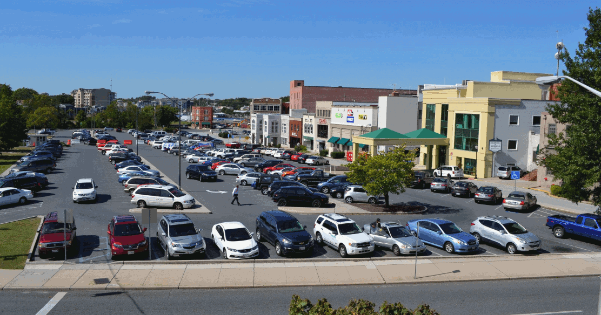

## Table of Contents

- [Introduction](introduction)
- [Setting Up the Development Environment](#setting-up-the-development-environment)
- [Adding the Machine Learning Packages](#adding-the-machine-learning-packages)
- [Running the Scripts](#running-the-scripts)

    1. [Demo 1 - OpenCV Image Capture and Display](#demo-1---opencv-image-capture-and-display)
    2. [Demo 2 - Mask R-CNN Segmentation and Detection](#demo-2---mask-r-cnn-segmentation-and-detection)
    3. [Demo 3 - Vehicle Localization](#demo-3---vehicle-localization)
    4. [Demo 4 - Creating and Displaying Zones](#demo-4---creating-and-displaying-zones)
    5. [Demo 5 - Counting Vehicles in Zones](#demo-5---counting-vehicles-in-zones)
    6. [Demo 6 - Creating the Database](#demo-6---creating-the-database)
    7. [Demo 7 - Putting It All Together](#demo-7---putting-it-all-together)

- [Schedule the Scripts Using cron](#schedule-the-scripts-using-cron)
- [References](#references)

----------

## Introduction

As interns at NASA Langley, aka "The Sherpas", we worked on a lot of projects. Some of them involved machine learning, and, yes, this included a parking lot project.

The use case was that finding parking is a problem for everyone. In 2016, drivers in New York City spent an average of 107 hours and $2243 a year looking for parking (INRIX, 2017). In addition, there are over 120 outstanding requests for proposals for city and institutional parking management (IPMI, 2019). One of the original Sherpas, who had been working on a similar project at Georgia Tech, suggested creating a parking management system for NASA Langley's Digital Transformation initiative, and it was approved.

We looked at various solutions, including sensors in each parking space; Light Detection and Ranging (LIDAR) to count cars entering and exiting parking areas; etc. Each approach had issues that made it impractical to implement with the resources we had; for example, most image recognition systems we looked at required a high, almost overhead, angle of view.

Finally, we came across  [Adam Geitgey's awesome article on object detection](https://medium.com/@ageitgey/snagging-parking-spaces-with-mask-r-cnnand-python-955f2231c400 "Snagging parking spaces with Mask R-CNN and Python"), which introduced us to  [Matterport Mask R-CNN](https://github.com/matterport/Mask_RCNN "Matterport Mask R-CNN")  (Geitgey, 2019). We realized that his implementation of Mask R-CNN was something we could use with the resources available to us, especially the lower and more practical viewing angle. However, Adam’s solution, designed for a single system for a single user looking at a single parking lot, was too expensive in terms of processing power and time. The first time we ran it, it sent our cooling fans into overdrive and hung our computers for several minutes; run another of our projects, [Acronyms for Tina](http://acronymsfortina.rgprogramming.com/index.html "Acronyms for Tina"), on localhost for a similar, albeit less intense, experience.

Still, it worked, so using what we learned, we went back to the drawing board to develop a system that would rotate through multiple lots; analyze and collect parking data; and present this information to users in a timely manner. After much trial and error, we came up with a system that leveraged Linux scripting, Python, OpenCV, TensorFlow, SQL, and PHP to:

1. Use a cron task scheduler to access the cameras overlooking each lot in turn.
2. Capture a frame from each camera; divide it into zones (e.g., employee, handicap, etc.); and count the number of vehicles in each zone.
3. Aggregate the results and collect them in a database.
4. Have the front-end pull data for users from the database.

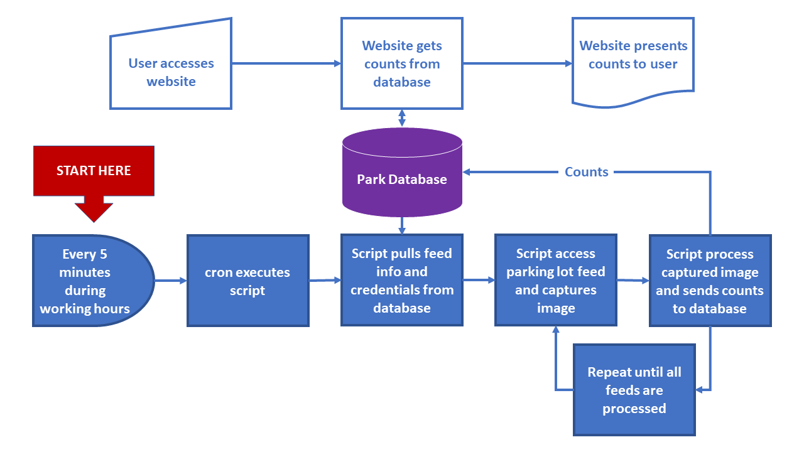

Due to architecture, security requirements, cross-lot tracking, etc., the NASA application, LaRC Park, was a bit complex, and for that reason, along with others, we will not recreate it here. However, here are a series of demos, written in Python, that breakdown the way the machine learning aspect works. Besides a practical application of object detection and instance segmentation, this is also a very good example of integrating computer vision, machine learning, SQL, and Linux scripting. Have fun and good luck!

----------

## Setting Up the Development Environment

As we just said, we'll be using CentOS Linux 7 in VirtualBox for this demo, but you can use another virtual machine or an actual server if you like. Just make sure that your system has at least 2GB of memory; 16GB of hard disk space; 128MB of video memory; and a connection to the Internet.

> ***NOTE**  - If you do choose to use CentOS or Red Hat Linux, we've included another README file name CENTOS with directions on how to set up your environment.*
>
> ***NOTE**  - While the production code for NASA only generated data, the demo scripts also display images. To view these images, you will need an X Server. For these demos, our solution was to use the GNOME Graphical User Interface (GUI) for development; it comes with a display server; it's lightweight; and it allows you to cut-and-paste from the host machine into the VM's Terminal. To use GNOME on CentOS or Red Hat Linux, use the following commands:*
>
>       sudo yum -y groupinstall "GNOME Desktop"
>       sudo startx

Our first step is to make sure the operating system is up to date. On CentOS, we would use the following command; other flavors of Linux may use "sudo apt-get update" instead, while Windows users can run "wuauclt.exe /updatenow":

    [park@localhost ~]# sudo yum -y update

This may take a while, especially on a new system.

Once the system update is completed, make sure that the tools needed for development are installed:

1. **Python 3 Programming Language Interpreter and PIP Python Package Installer**  - While Python 2 is installed with CentOS by default, we will need Python 3 to run our computer vision and machine learning scripts, specifically Python 3.6.x. There are a few ways of doing this, but we will use the IUS Community Repo; for an in-depth look at options, check out  [this link from James Hogarth](https://www.hogarthuk.com/?q=node/15 "Running newer applications on CentOS"). To install Python, run the following command:

        [park@localhost ~]# sudo yum -y install https://centos7.iuscommunity.org/ius-release.rpm
        [park@localhost ~]# sudo yum -y install python36u
        [park@localhost ~]# sudo yum -y install python36u-pip
        [park@localhost ~]# sudo yum -y install python36u-devel
        [park@localhost ~]# python3 --version
        [park@localhost ~]# pip3 --version

2. **SQLite RDBMS**  - For portability (and to keep this README as short as possible), we'll be using SQLite. Check the version using the following command:

        [park@localhost ~]# sqlite3 -version
        3.7.17 2013-05-20 00:56:22 118a3b35693b134d56ebd780123b7fd6f1497668

    If SQLite is not installed, install it using the following command:

        [park@localhost ~]# sudo yum -y install sqlite

3. **cron Time-Based Job Scheduler**  - cron should already be installed by default, but check anyway:

        [park@localhost ~]# whereis -b crontab | cut -d' ' -f2 | xargs rpm -qf
        cronie-1.4.11-19.e17.x86_64

    If cron is not installed, install it using the following command:

        [park@localhost ~]# yum -y install cronie

Alright! Before continuing, let's do another update of the system using the following command:

    [park@localhost ~]# sudo yum -y update

Just in case, we'll double check everything is installed and updated using the following commands:

    [park@localhost ~]# python3 ––version
    [park@localhost ~]# pip3 ––version
    [park@localhost ~]# sqlite3 -version
    [park@localhost ~]# whereis -b crontab | cut -d' ' -f2 | xargs rpm -qf

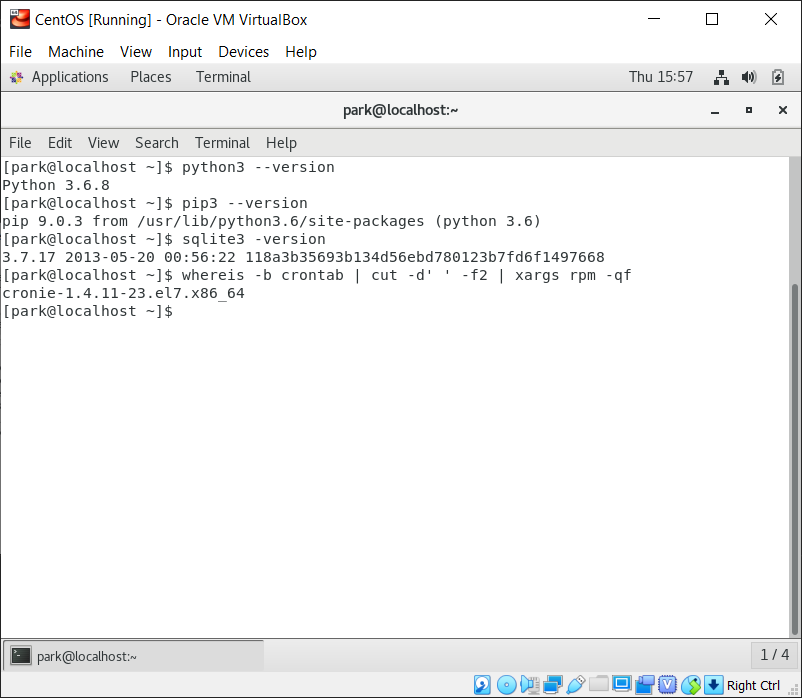

----------

## Adding the Machine Learning Packages

Our next step is to add the packages we will need to run the scripts. While you can enter the code yourself, we suggest you clone this repository into your folder:  **Just make sure you do so before installing the ML packages.**  Use the following command to clone the repo:

    git clone https://github.com/garciart/Park.git

This will create a folder "Park" with all the code in the right place. If you are using a shared folder, fetch into your shared folder instead of cloning:

    [park@localhost ~]# cd Park # replace Park with the name of your shared folder
    [park@localhost Park]$ git init
    [park@localhost Park]$ git remote add origin https://github.com/garciart/Park.git
    [park@localhost Park]$ git fetch
    [park@localhost Park]$ git checkout origin/master -ft

As a rule, we don't use the "Master" branch, just like we don't use "root" for development. You don't have to, but we suggest creating a separate branch:

    [park@localhost ~]# cd Park # replace Park with the name of your shared folder
    [park@localhost Park]$ git branch park # replace park with your username
    [park@localhost Park]$ git checkout park # replace park with your username
    [park@localhost Park]$ git status

In addition, remember to use "Park" as your development folder, not the home folder (in our case, "park").

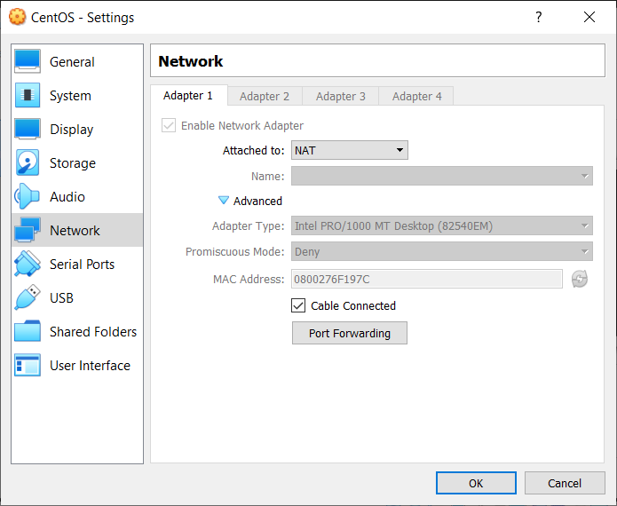

Clone the excellent  [Mask R-CNN engine from Matterport](https://github.com/matterport/Mask_RCNN "Mask R-CNN engine from Matterport"), which will serve as our object detection and instance segmentation engine using the following commands:

    [park@localhost Park]$ git clone https://github.com/matterport/Mask_RCNN.git
    [park@localhost Park]$ cd Mask_RCNN
    [park@localhost Mask_RCNN]$ ls
    [park@localhost Mask_RCNN]$ cat requirements.txt

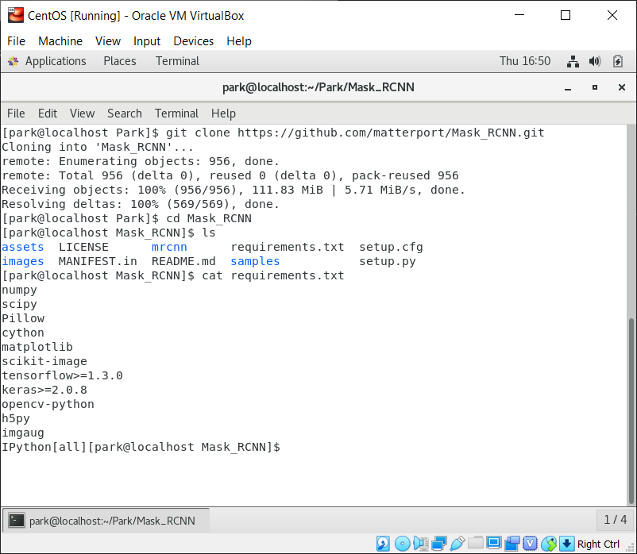

Note the setup.py file, which will build and install the Mask RCNN engine, and the requirements.txt file, which contains the list of modules and packages we will need to run the Mask RCNN engine:

- [numpy](https://numpy.org/ "numpy")  - Adds support for high-level mathematics involving arrays and matrices.
- [scipy](https://scipy.org/scipylib "scipy")  - Adds support for scientific and technical computing.
- [Pillow](https://python-pillow.org/ "Pillow")  - Python Imaging Library to open, manipulate and save image files.
- [cython](https://cython.org/ "cython")  - Adds support for C extensions and datatypes in Python.
- [matplotlib](https://matplotlib.org/ "matplotlib")  - Adds support for 2d plotting.
- [scikit-image](https://scikit-image.org/ "scikit-image")  - Adds support for image processing.
- [tensorflow](https://www.tensorflow.org/ "tensorflow")  - Adds support for machine learning and tensor mathematics.
- [keras](https://keras.io/ "keras")  - Adds support for neural networks.
- [opencv-python](https://opencv.org/ "opencv")  - Adds support for real-time computer vision.
- [h5py](https://www.h5py.org/ "h5py")  - Adds support for implementing HDF5 binary data format.
- [imgaug](https://imgaug.readthedocs.io/en/latest/ "imgaug")  - Adds support for for image augmentation in machine learning.
- [IPython[all]](https://ipython.org/ "IPython")  - Adds support for interactive computing.

However, before executing installing requirements.txt, we have to make some changes. Unfortunately, Matterport's version of Mask R-CNN cannot use TensorFlow 2.0 or Keras 2.3 or above. In addition, we will need to install  [OpenCV's extra modules](https://docs.opencv.org/master/ "opencv-python-contrib")  to display images. Using your favorite editor, change the TensorFlow and Keras lines to the following:

    tensorflow>=1.3.0,<2.0
    keras>=2.0.8,<2.3

In addition, add the following line after the OpenCV line:

    opencv-contrib-python

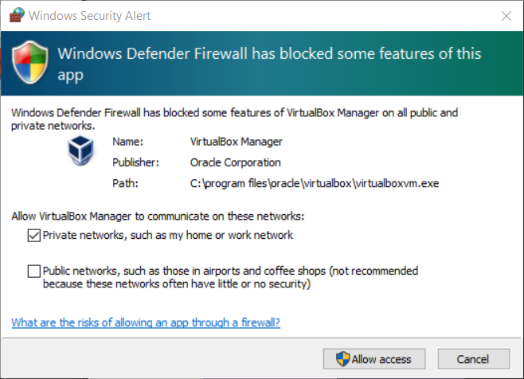

We also have to make sure our  [Setuptools](https://setuptools.readthedocs.io/en/latest/ "Setuptools")  are up-to-date. Otherwise, we may run into errors extracting and creating modules and packages from requirements.txt. In addition, we have to make sure  [tkinter, the standard Python interface to the Tk GUI toolkit](https://docs.python.org/3/library/tkinter.html "tkinter"), is installed as well, or you may get a "matplotlib is currently using a non-GUI backend" error. Therefore, enter the following commands:

    [park@localhost Mask_RCNN]$ pip3 install --upgrade setuptools --user
    [park@localhost Mask_RCNN]$ sudo yum -y install python3-tkinter

Once the installation is complete, install Mask R-CNN's requirements using the following command:

    [park@localhost Mask_RCNN]$ pip3 install -r requirements.txt --user

Hopefully, everything went well; if not, check the verbose comments for any errors and correct them. Remember, you may have to use a different flavor of a package depending on the system you are using. For example, we used Red Hat Linux, so for some packages, we had to use their version (e.g., python36-mysql, etc.). You can look for packages using:

    [park@localhost Mask_RCNN]$ pip3 list
    - or -
    [park@localhost Mask_RCNN]$ yum search [package name]

Once everything is set, run the setup script using the command:

    [park@localhost Mask_RCNN]$ python3 setup.py install --user

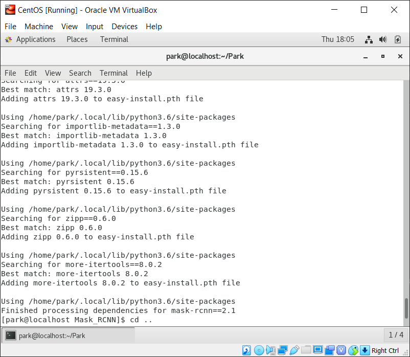

Once again, check the verbose comments for any errors and correct them. Finally, go back one directory and download the Common Objects in Context (COCO) dataset by using the following commands:

    [park@localhost Mask_RCNN]$ cd ..
    [park@localhost Park]$ wget https://github.com/matterport/Mask_RCNN/releases/download/v2.0/mask_rcnn_coco.h5

The COCO dataset consists of over 100,000 images of 80 objects, including cars (#3), buses (#6), and trucks (#8); find out more at  [http://cocodataset.org](http://cocodataset.org/ "COCO Dataset"). Please note that you can replace this dataset with a more specific set for vehicle detection, but for now, we will use the COCO dataset:

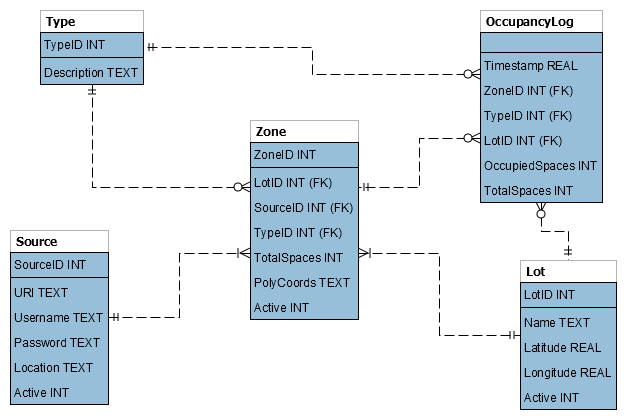

----------

## Running the Scripts

Now comes the fun part: Writing and running the scripts. Before we start, a few words of caution if you are switching between operating systems:

- ### Watch your line endings!

- ### Make sure you stick to using either tabs or spaces!

Our Python code is a combination of Matterport's open-source Mask-RCNN's samples (Matterport, 2019), Alex Geitgey's excellent article on detecting open parking spaces (Geitgey, 2019), and our own embellishments (all MIT licensed, of course). By the time you are done working through these demos, you should have a good understanding how the heavy lifting occurs on the back end.

> **NOTE**  - To view these images generated by the demo scripts, you will need an X Server; otherwise, OpenCV will display a "Failed to Start the X server" error. Our solution was to use the GNOME Graphical User Interface (GUI) for development; it came with a display server; it was lightweight; and it allowed us to cut-and-paste from the host machine into the VM's Terminal. To do so on Linux, use the following commands:
>
>       sudo yum -y groupinstall "GNOME Desktop"
>       sudo startx

Download the demos to your development folder if you did not clone or fetch the repo. There are seven demos, and each one adds new functionality to Park.

- demo1.py - OpenCV image capture and display demo.
- demo2.py - Adds Mask R-CNN object detection and segmentation to the demo.
- demo3.py - Adds object localization to the demo.
- demo4.py - Adds creating and displaying zones to the demo.
- demo5.py - Adds counting vehicles in zones to the demo.
- demo6.py - Creates the database.
- demo7.py - El Super Demo: Incorporates communicating with the database and the functionality of all of the previous demos.

You will also need the log, capture, image, and video folders. If you cloned or fetched the repository, your directory should look like this:

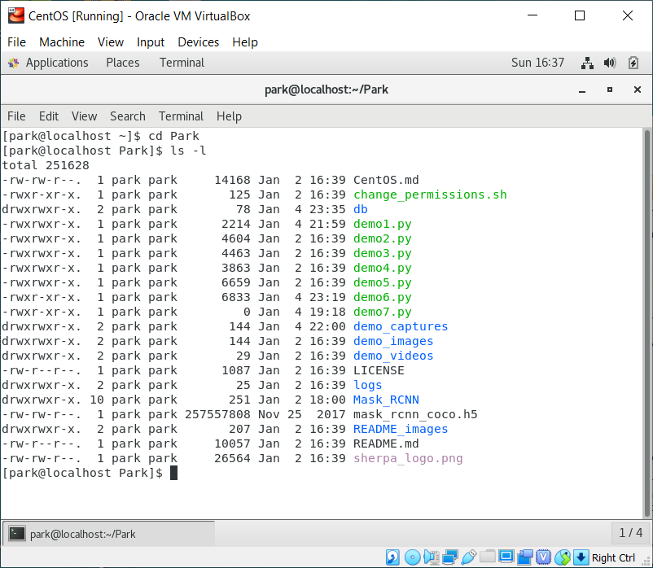

Once you are all set up, open the code for each demo in your favorite editor as we get to it and follow along. By the way, each script has its own "shebang" at the top of the code...

    #!/usr/bin/python3

...so you can run them directly by setting each scripts permissions to executable or by running the change_permissions.sh shell script:

    sudo chmod 755 demoX.py
    - or -
    sudo ./change_permissions.sh

----------

### Demo 1 - OpenCV Image Capture and Display

This one is pretty easy, but using OpenCV is the foundation of Park's image recognition system. Note that we listed four FRAME_SOURCE's, with three of them commented out:

    # Image, video or camera to process - set this to 0 to use your webcam instead of a file
    # FRAME_SOURCE = [(IMAGE_DIR + "/demo_image1.jpg"),(IMAGE_DIR + "/demo_image2.jpg"),(IMAGE_DIR + "/demo_image3.jpg")]
    # FRAME_SOURCE = [(VIDEO_DIR + "/demo_video1.mp4"),(VIDEO_DIR + "/demo_video2.mp4"),(VIDEO_DIR + "/demo_video3.mp4")]
    # FRAME_SOURCE = [(IMAGE_DIR + "/demo_image.jpg")]
    FRAME_SOURCE = ["https://raw.githubusercontent.com/garciart/Park/master/demo_images/demo_image.jpg"]

Park can work with images, videos and live streams. While we use demo_image.jpg, feel free to switch sources during the first three demos. However, to work correctly with this tutorial, Demos 4 through 5 need to use demo_image.jpg, while Demo 7 pulls what it needs from the database you will create in Demo 6.

Note the colors. OpenCV uses a Blue-Green-Red (BGR) color model, which we converted to an RGB color model for Mask R-CNN:

    # Convert the image from BGR color (which OpenCV uses) to RGB color
    rgb_image = frame[:, :, ::-1]

We did not notice a difference in detection accuracy when we ran the other scripts, but we do what the great guys at Matterport tell us to do!

By the way, this script also saves a full-size copy of the image in the demo_captures folder, named "d1_capture.jpg". You will need this image for demo4.py to create zones using pixel coordinates.

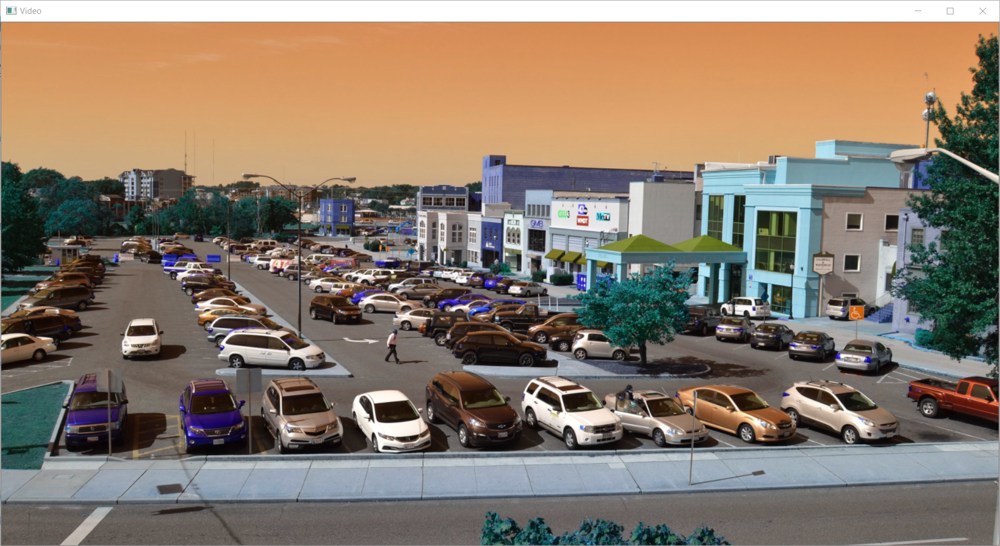

> ***NOTE**  - After some installations, you may receive the following error when attempting to use cv2.imshow():*
>
>       The function is not implemented. Rebuild the library with Windows, GTK+ 2.x or Carbon support.
>
> *To correct this problem, force reinstall OpenCV using the following commands:*
>
>       pip3 install --upgrade --force-reinstall opencv-python --user
>       pip3 install --upgrade --force-reinstall opencv-contrib-python --user

----------

### Demo 2 - Mask R-CNN Segmentation and Detection

Speaking of Mask R-CNN, it is time to add it to the demo. As we stated earlier, we are using the Common Objects in Context (COCO) dataset for this demo. The COCO dataset has 80 classes of objects, of which we want three: cars (#3), trucks (#6), and buses (#8):

    # COCO Class names
    # Index of the class in the list is its ID. For example, to get ID of
    # the teddy bear class, use: class_names.index('teddy bear')
    class_names = ['BG', 'person', 'bicycle', 'car', 'motorcycle', 'airplane',
                   'bus', 'train', 'truck', 'boat', 'traffic light',
                   'fire hydrant', 'stop sign', 'parking meter', 'bench', 'bird',
                   'cat', 'dog', 'horse', 'sheep', 'cow', 'elephant', 'bear',
                   'zebra', 'giraffe', 'backpack', 'umbrella', 'handbag', 'tie',
                   'suitcase', 'frisbee', 'skis', 'snowboard', 'sports ball',
                   'kite', 'baseball bat', 'baseball glove', 'skateboard',
                   'surfboard', 'tennis racket', 'bottle', 'wine glass', 'cup',
                   'fork', 'knife', 'spoon', 'bowl', 'banana', 'apple',
                   'sandwich', 'orange', 'broccoli', 'carrot', 'hot dog', 'pizza',
                   'donut', 'cake', 'chair', 'couch', 'potted plant', 'bed',
                   'dining table', 'toilet', 'tv', 'laptop', 'mouse', 'remote',
                   'keyboard', 'cell phone', 'microwave', 'oven', 'toaster',
                   'sink', 'refrigerator', 'book', 'clock', 'vase', 'scissors',
                   'teddy bear', 'hair drier', 'toothbrush']

However, Mask R-CNN runs through all of the classes, making it inefficient. Eventually, we hope to replace it with a smaller dataset focused on vehicles, which will make the processing faster.

The script loads a pre-trained model, collects the rgb_image from the camera, and then processes the image against the model, creating an array of detected objects:

    # Load pre-trained model
    model.load_weights(COCO_MODEL_PATH, by_name=True)
    ...
    ...
    # Run the image through the Mask R-CNN model to get results.
    results = model.detect([rgb_image], verbose=0)

We use the built-in visualize function to display the instance segmentation on the screen:

    # Show the frame of video on the screen
    mrcnn.visualize.display_instances(rgb_image, r['rois'], r['masks'], r['class_ids'], class_names, r['scores'])

Once again, look at the code and note the changes between demo1.py and demo2.py, especially the imports. Also note that if the dataset you downloaded earlier is missing, the script will automatically download it from Matterport's GitHub repository, using mrcnn.utils. If you are behind a firewall, as we were at NASA, you can disabled this functionality with the following code:

    # Do not download COCO trained weights from Releases if needed!
    if not os.path.exists(COCO_MODEL_PATH):
        # mrcnn.utils.download_trained_weights(COCO_MODEL_PATH)
        print("Oh no! We are missing the mask_rcnn_coco.h5 dataset!")

----------

### Demo 3 - Vehicle Localization

In the previous demo, Mask R-CNN placed masks on every item it detected. However, as we stated earlier, we are only looking for vehicles. Therefore, we added the get_car_boxes function, which returns a numpy array of the cars (#3), trucks (#6), and buses (#8) that Mask R-CNN detected:

    # Filter a list of Mask R-CNN detection results to get only the detected cars / trucks
    def get_car_boxes(boxes, class_ids):
        car_boxes = []
    
    for i, box in enumerate(boxes):
        # If the detected object isn't a car / truck, skip it
        if class_ids[i] in [3, 8, 6]:
            car_boxes.append(box)
    
    return np.array(car_boxes)

We use that array with the OpenCV rectangle function to box the vehicles in:

    # Draw the box
    cv2.rectangle(frame, (x1, y1), (x2, y2), (0, 255, 0), 2)

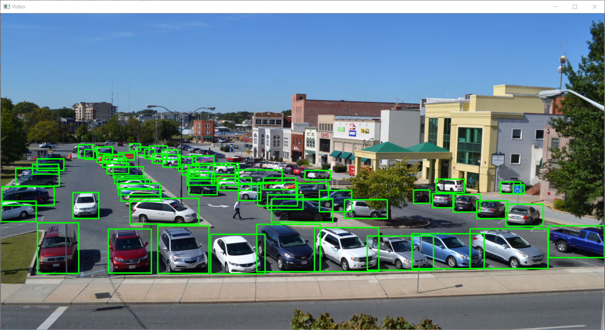

We also acquired their locations in the frame, which we will use this later to determine if a vehicle is within a zone.

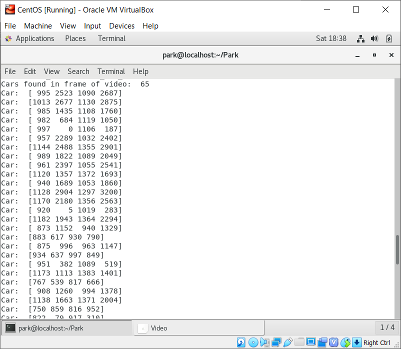

----------

### Demo 4 - Creating and Displaying Zones

Next, we create the zones using OpenCV. We will only count cars within these zones, to avoid counting cars on roads, other parking lots, etc. In addition, each of these zones will have a zone type (e.g., employee, handicap, etc.), which will allow us to provide better counts to the users.

Using the frame you captured in demo1.py and your favorite image viewer/editor, determine the pixel coordinates of each zone and enter them in the poly_coords array. For demo4.py, we created two zones, employee and handicap, and overlaid them on the frame:

    # Read clockwise from top-left corner
    poly_coords = ([[751, 1150], [3200, 1140], [3200, 1350], [851, 1400]],
                    [[240, 1140], [750, 1150], [850, 1400], [150, 1400]])
    
    # BGR colors: Orange, Blue, Red, Gray, Yellow, Cyan, Pink, White
    colors = [[0, 127, 255], [255, 0, 0], [0, 0, 255], [127, 127, 127],
              [0, 255, 255], [255, 255, 0], [127, 0, 255], [255, 255, 255]]
    
    # Make an overlay for transparent boxes
    overlay = frame.copy()
    
    # Draw the filled zones
    for index, p in enumerate(poly_coords, start=0):
        cv2.fillPoly(overlay, np.int32([np.array(p)]), colors[index + 4])
    
    # Set transparency for boxes
    alpha = 0.4
    # Add overlay to frame
    frame = cv2.addWeighted(overlay, alpha, frame, 1 - alpha, 0)
    
    # Optional Draw the zone boundaries
    for index, p in enumerate(poly_coords, start=0):
        cv2.polylines(frame, np.int32([np.array(p)]), True, colors[index], 10)
    
    # Draw center crosshair
    height, width, channels = frame.shape
    cv2.drawMarker(frame, (int(width / 2), int(height / 2)),
        [255, 255, 0], cv2.MARKER_TRIANGLE_UP, 16, 2, cv2.LINE_4)
    # Add timestamp
    cv2.putText(frame, timestamp, (10, 30),
        cv2.FONT_HERSHEY_SIMPLEX, 1, [0, 0, 255], 1)

The cyan triangle in the middle is a calibration point. For Pan-Tilt-Zoom (PTZ) cameras, if the triangle and an outside reference point (e.g., a cone, sign, etc.) line up, the zone overlays are placed correctly on the frame. To see your work, this script also saves a time-stamped scaled copy of the image in the demo_captures folder, named "[YYMMDD]_d4_capture.jpg".

----------

### Demo 5 - Counting Vehicles in Zones

Now that we have our zones, we will run Mask R-CNN again, but we will use Shapely's centroid and intersects function to determine if a vehicle is in a zone. Using the center point prevents vehicles from being counted in a zone they overlap, but do not occupy. If a vehicle is in a zone, it is added to the zone's count. However, is is deleted from the numpy array, to avoid double counting cars that may intersect more than one zone:

    # Only show cars in the zones!
    if(((Polygon([(x1, y1), (x2, y1), (x1, y2), (x2, y2)])).centroid).intersects(Polygon(asPoint(array(p))))):
        # Draw the box and add to overlay
        cv2.rectangle(frame, (x1, y1), (x2, y2), colors[index], 5)
        # Count car in zone
        count += 1
        # Delete the car to avoid double counting
        np.delete(car_boxes, box)

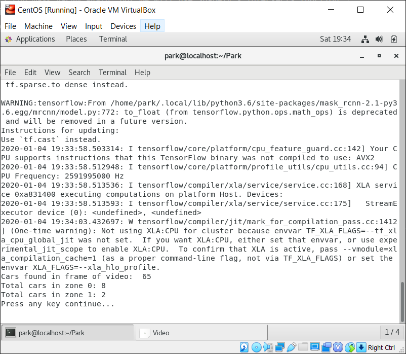

----------

### Demo 6 - Creating the Database

Like we stated earlier, due to architecture, security requirements, cross-lot tracking, etc., the NASA application was complex, and required two separate databases. For our demo, we will use a simpler data model, and, for portabililty (and to keep this README from being longer than it already is!) we'll use SQLite to hold the data.

As stated earlier, Park counts the number of vehicles in parking zones. We found that a single camera cannot always observe a complete lot. Instead, a camera can observe portions of multiple lots and a lot can be observed by multiple cameras. Therefore, we divided each feed into zones, with each zone associated with a lot, and, as shown in demo4.py, each zone is classified as employee parking, handicap parking, etc. In demo7.py. we will show you how Park cycles through and analyzes all the feeds every five minutes, collecting the counts for the zones that each camera can observe. Once the cycle is complete, Park can aggregate the counts into lot totals, which the front end can present to the user.

Here's the data model:

And here are the table descriptions:

- **Source:**  This table contains a list of the sources, such as cameras, that collect images, as well as their location and credentials. The camera's URL is a unique value.
- **Lot:**  This table contains a list of parking lots, as well as their location in latitude and longitude. The lot name is a unique value.
- **Type:**  This table contains a list of zone types, such as employee parking, handicap parking, etc. The description is a unique value.
- **Zone:**  This table contains all the zones from all the lots in the database. It also contains the total number of parking spaces within each zone, as well as the boundaries of the zone within its source's frame. This table has a one-to-many relationship with Source, Lot, and Type, and a unique constraint comprised of the primary keys of each of those tables and its own ZoneID.
- **OccupancyLog:**  This table is a junction table (i.e., an associative entity) that collects and timestamps all the zone counts, providing both current and historical parking data. This table has a one-to-many relationship with Lot, Zone, and Type, and a unique constraint comprised of the primary keys of each of those tables and its own Timestamp.

The relationships between the tables are as follows:

- Each Zone has only one Source, but a Source may observe one or many Zones.
- Each Zone has only one Type, but a Type may apply to zero or many Zones.
- Each Zone is located in only one Lot, but a Lot may contain one or many Zones.
- Each Occupancy Log entry lists one Zone, but a Zone may appear in zero to many Occupancy Log entries.
- Each Occupancy Log entry lists one Type, but a Type may appear in zero to many Occupancy Log entries.
- Each Occupancy Log entry lists one Lot, but a Lot may appear in zero to many Occupancy Log entries.

Run demo6.py to create the database in the db folder and open the database using the following commands:

    [park@localhost Park]$ ./demo6.py
    [park@localhost Park]$ ls db
    [park@localhost Park]$ sqlite3 db/park.db

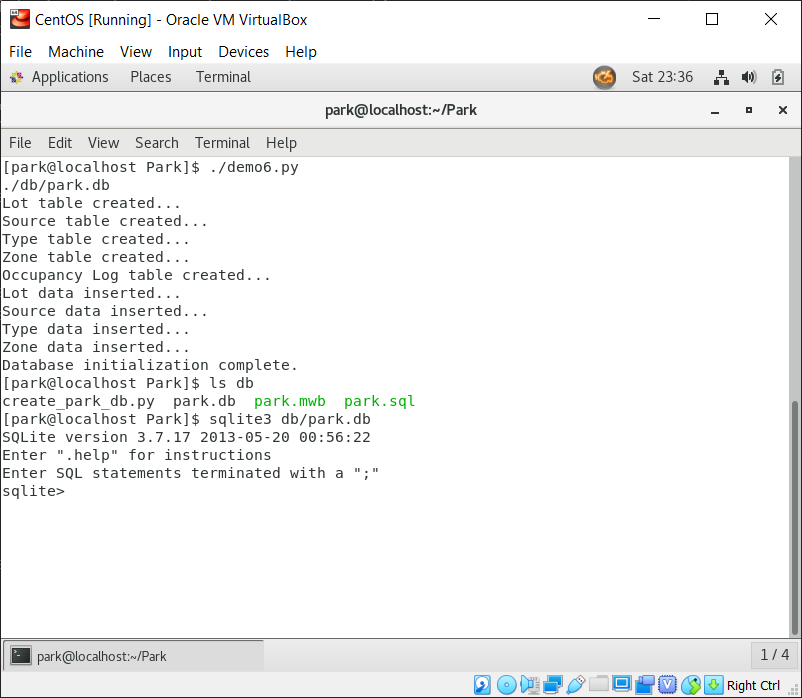

Once complete, test the new database with the some queries. Here are some examples; if they do not work, check for any errors that may have occurred when you created the database:

    sqlite> SELECT * FROM Lot ORDER BY Name ASC;
    sqlite> SELECT * FROM Lot WHERE LotID = 1;
    sqlite> SELECT * FROM Type ORDER BY TypeID ASC;
    sqlite> SELECT * FROM Source ORDER BY SourceID ASC;
    sqlite> SELECT Zone.ZoneID, Source.Location, Type.Description, Lot.Name, Zone.TotalSpaces, Zone.PolyCoords
                FROM Zone
                INNER JOIN Source ON Zone.SourceID = Source.SourceID
                INNER JOIN Type ON Zone.TypeID = Type.TypeID
                INNER JOIN Lot ON Zone.LotID = Lot.LotID
                ORDER BY Lot.Name, Type.Description;

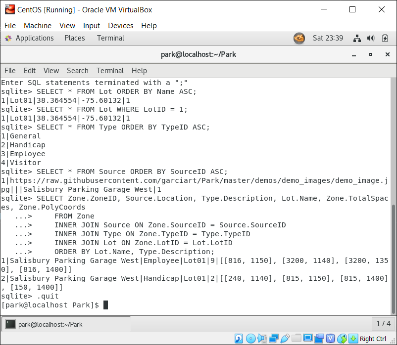

----------

### Demo 7 - Putting It All Together

Finally! demo7.py is a super demo. It incorporates all of the functionality of the previous demos, but it actually connects to the database to get feed credentials and to update data.

> *By the way, demo7.py requires user interaction after displaying each frame. The above image is an animation of the demo7.py results, created using GIMP.*

The first statement gets the URI, credentials, and location of the source. You must have one active source for the demo to work; the demo URL is from this repo's demo_image folder:

    source = query_database("SELECT * FROM Source").fetchall()

The second query gets all the zones associated with that source, as well as the description (e.g., handicap, etc.) of the zones from Type:

    sql = "SELECT Zone.*, Type.Description FROM Zone JOIN Type USING(TypeID) WHERE SourceID = {}".format(s['SourceID'])

The final statement updates the occupany log with the count of vehicles within a zone:

    sql = "INSERT INTO OccupancyLog (ZoneID, LotID, TypeID, Timestamp, OccupiedSpaces, TotalSpaces) VALUES ({}, {}, {}, {}, {}, {})".format(z['ZoneID'], z['LotID'], z['TypeID'], "'{}'".format(timestamp), count, z['TotalSpaces'])

Once you run the script, look for the latest entries in the OccupancyLog, which holds current and historical data. They should match the counts of the demo; double check using the following query:

    sqlite> SELECT ZoneID, OccupiedSpaces, TotalSpaces, Timestamp FROM OccupancyLog;

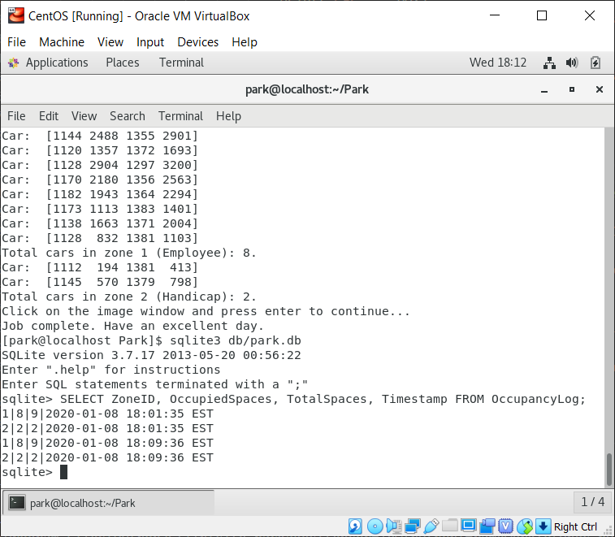

Before you continue, we recommend you look over both the capture.py script, which is similar to demo4.py, but does not display images, and the park.py script, which is similar to demo7.py, but does not display images either. You should have a good understanding on how they work, since they will be used to automatically capture images and update the database.

----------

## Schedule the Scripts Using cron

If Park had to run Mask R-CNN and Tensorflow each time it was opened, as well as get feeds, the site would be *SLOWWWWW!* Instead, we use cron, the Linux task scheduler, to do all that work in the background, and use the database as the intermediary between the cron daemon and the front end. As stated before, cron will run park.py, which counts the vehicles in the lots, every five minutes, between 0400 and 1859, Monday thru Friday, and run capture.py, which captures the feed image, every day at 1000, Monday thru Friday.

Open the cron table for editing using the following command:

    [park@localhost Park]$ crontab -e

On our system, cron uses the Vim text editor by default. If you want to use a different editor, check out [Dave McCay's great article about setting the default editor.](https://www.howtogeek.com/410995/how-to-change-the-default-crontab-editor/ "How to Change the Default crontab Editor")

Go into insert mode by pressing [i], then add the following lines. Please note that you only have to enter the last two lines; the cheat sheet in the comments (#) is not necessary, but we found that it makes life easier:

    # Minute of the Hour (0 - 59)
    # |      Hour of the Day (0 - 23)
    # |      |      Day of the Month (1 - 31)
    # |      |      |      Month of the Year (1 - 12 / 1 = January)
    # |      |      |      |      Day of the Week (0 - 6 / 0 = Sunday)
    # |      |      |      |      |      Script to Run
    # |      |      |      |      |      |
      */5    04-18  *      *      1-5    /home/park/Park/park.py
      0      10     *      *      1-5    /home/park/Park/capture.py

Press [ESC] to return to command mode, then enter ":wq" to write out and quit. Wait about 5 to 15 minutes and enter the following
commands

    [park@localhost Park]$ cron-tab -l
    [park@localhost Park]$ mail

crontab -l shows a listing of all active cron jobs, and mail brings up the results of the cron jobs:

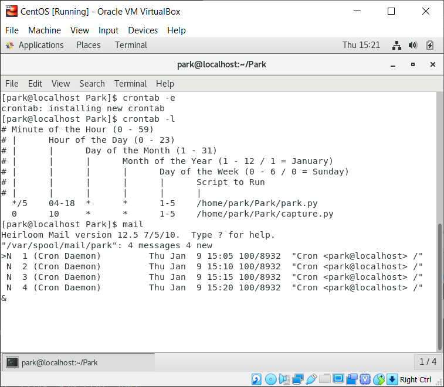

Type in the number of the message you want to read and it should open up:

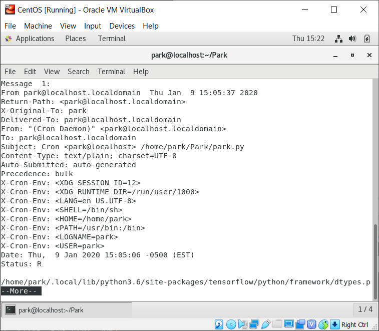

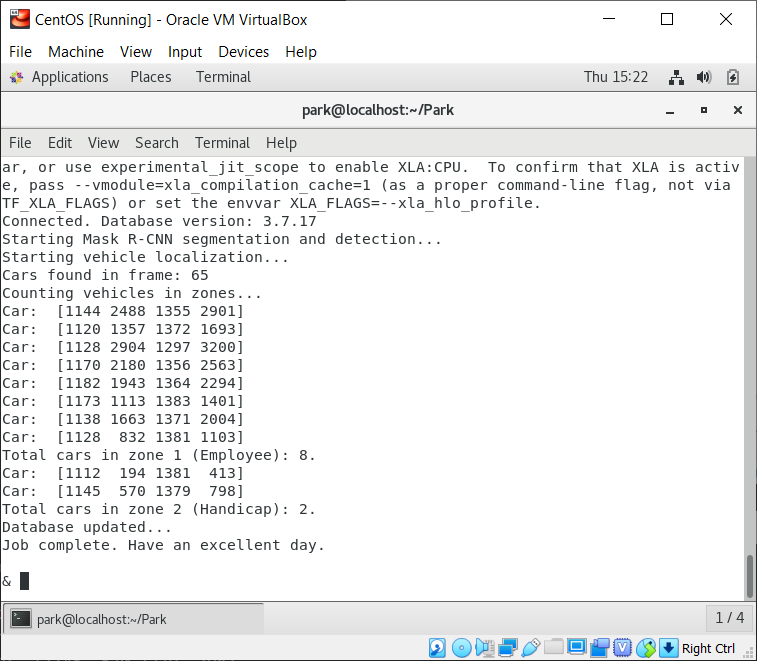

As you can see, cron job mail captures the verbose comments and results from running the scripts. In this case, the script
successfully counted vehicles in zone, but you should monitor the database and the cron job mail for any errors due to system changes or patches, etc.

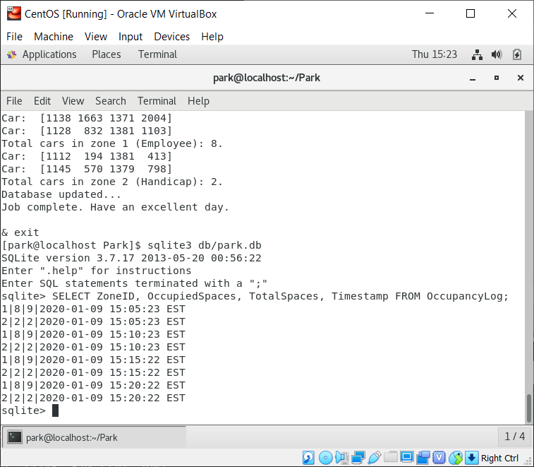

By the way, inputing exit once will exit mail and entering exit again will exit cron.

If the mailbox gets too big, you can delete old mail by using the following command:

    [park@localhost Park]$ cat /dev/null >/var/spool/mail/Park

Congratulations! The system is now on autopilot. If you like, you can now add a back-end to view, add, edit, or delete data from the database, as well as a front-end for anonymous users to find parking lots with open spaces.

----------

## 
And that is all for now from Team Sherpa! So long, and thank you, thank you very much!

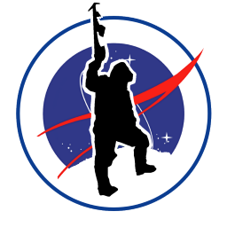

### 
The Sherpas are Jrei Dimanno, Justine Forrest, Rob Garcia, John Graham, Tanner Griffin, Ryan Hashi, Brandon Hutton, Gabriel Jacobs, Fernando Jauregui, Wesley Madden, and Doug Trent

----------

## References

Geitgey, A. (2019, January 21). Snagging parking spaces with Mask R-CNN and Python. Retrieved from  [https://medium.com/@ageitgey/snagging-parking-spaces-with-mask-r-cnnand-python-955f2231c400](https://medium.com/@ageitgey/snagging-parking-spaces-with-mask-r-cnnand-python-955f2231c400 "Snagging parking spaces with Mask R-CNN and Python")

INRIX. (2017, July 12). Searching for parking costs Americans $73 billion a year. Retrieved from  [http://inrix.com/press-releases/parking-pain-us/](http://inrix.com/press-releases/parking-pain-us/ "Searching for parking costs Americans $73 billion a year")

International Parking and Mobility Institute. (2015, October 12). Open requests for proposals. Retrieved July 31, 2019, from  [https://www.parking.org/membership/member-resources/rfps/](https://www.parking.org/membership/member-resources/rfps/ "Open requests for proposals")

Matterport, Inc. (2019, March 10). matterport/Mask_RCNN. Retrieved August 2, 2019, from  [https://github.com/matterport/Mask_RCNN](https://github.com/matterport/Mask_RCNN "matterport/Mask_RCNN")
