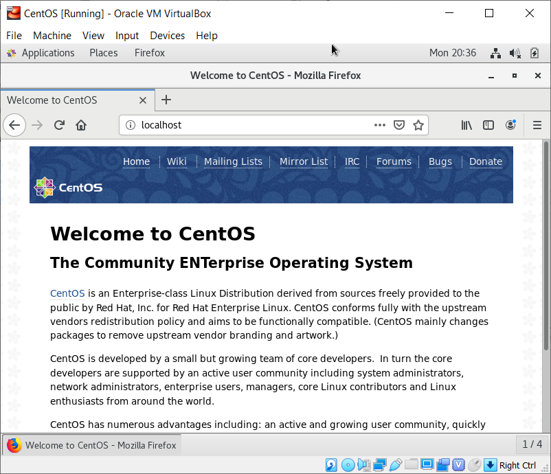
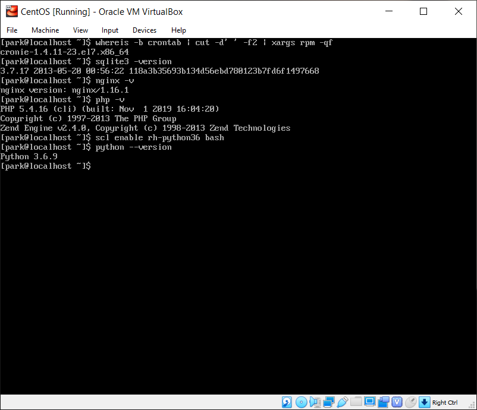
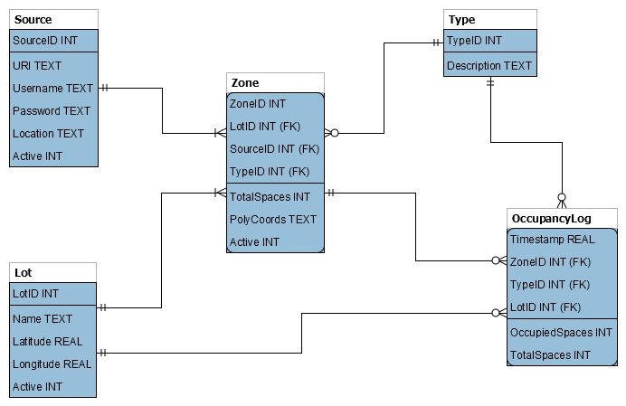

# Park!

<h2>Introduction</h2>

As interns at NASA Langley, aka "The Sherpas", we worked on a lot of projects. Some of them involved machine learning, and, yes, this included a parking lot project with Georgia Tech. Due to architecture, security requirements, cross-lot tracking, etc., the NASA application was a bit complex, but here is a simplified version. It includes the full stack; SQL, Python, Linux scripts, HTML, CSS, JavaScript, and PHP, as well as cool computer vision and machine learning demos.

While the orginal system ran on three separate Red Hat Linux servers using Apache and MySQL, our demonstration system will run on the following system:

<ul>
    <li>Oracle VirtualBox Virtual Machine (VM) Manager(using 6.0.6)</li>
    <li>CentOS Linux 7 (using 3.10.0-957.e17.x86_84)</li>
    <li>cron Time-Based Job Scheduler (using cronie-1.4.11-19.e17.x86_64)</li>
    <li>SQLite Relational Database Management System (RDBMS) (using 3.7.17)</li>
    <li>Extra Packages for Enterprise Linux (EPEL) (using epel-release-7-11.noarch)</li>
    <li>Nginx Hypertext Transfer Protocol (HTTP) Web Server (using nginx.x86_64 1:1.16.1-1.e17)</li>
    <li>Python 3 Programming Language Interpreter (using version 3.6.8)</li>
    <li>PHP Hypertext Preprocessor (using version 5.4.16) with Zend Engine Interpreter (using version 2.4.0)</li>
</ul>

<h2>Setup</h2>

As we just said, we'll be using CentOS Linux 7 in VirtualBox for this demo, but you can use another virtual machine or an actual server if you like. Just make sure that your system has at least 2GB of memory; 16GB of hard disk space; 128MB of video memory; and a connection to the Internet.

We'll be using the default minimal install option. Since our focus is on getting Park up and running, we won't get into creating a CentOS VM in VirtualBox. Several online walkthroughs exist: <a href="https://tutorials.kurtobando.com/install-a-centos-7-minimal-server-in-virtual-machine-with-screenshots/" target="_blank">Kurt Bando's tutorial</a> is an excellent walkthrough.

Once the VM is setup and to start things off right, let's create a super user to avoid using the root user:

<pre>
[root@localhost ~]# adduser park
[root@localhost ~]# passwd park
Changing password for user park.
New password: ********
Retype new password: ********
passwd: all authentication tokens updated successfully.
[root@localhost ~]# gpasswd -a park wheel
Adding user park to group wheel
[root@localhost ~]# su - park
[park@localhost ~]#
</pre>

Next, update the system and add CentOS' development tools using the following commands:

<pre>
[park@localhost ~]# sudo yum -y update
[park@localhost ~]# sudo yum -y install yum-utils
[park@localhost ~]# sudo yum -y groupinstall development
</pre>

This may take a while, especially on a new system.

Once the system update is completed, make sure that we have everything we need:

<ol>
    <li><b>cron Time-Based Job Scheduler</b> - cron should be already installed, but check anyway:
<pre>
[park@localhost ~]# whereis -b crontab | cut -d' ' -f2 | xargs rpm -qf
cronie-1.4.11-19.e17.x86_64
</pre>
        
If cron is not installed, install it using the following command:

<pre>[park@localhost ~]# yum -y install cronie</pre>
    </li>
    <li><b>SQLite RDBMS</b> - SQLite should also be installed, but check anyway:
<pre>
[park@localhost ~]# sqlite3 -version
3.7.17 2013-05-20 00:56:22 118a3b35693b134d56ebd780123b7fd6f1497668
</pre>
        
If SQLite is not installed, install it using the following command:

<pre>
[park@localhost ~]# sudo yum -y install sqlite
</pre>
    </li>
    <li><b>Nginx HTTP Web Server</b> - To use Nginx, install the <a href="https://fedoraproject.org/wiki/EPEL" target="_blank">Extra Packages for Enterprise Linux (EPEL)</a> first:
<pre>
[park@localhost ~]# sudo yum -y install epel-release
</pre>
        
Once the installation is completed, install Nginx:

<pre>
[park@localhost ~]# sudo yum -y install nginx
</pre>
        
Once Nginx is installed, start the server. In addition, run the second command so that Nginx automatically starts when the system boots up:

<pre>
[park@localhost ~]# sudo systemctl start nginx
[park@localhost ~]# sudo systemctl enable nginx
Created symlink from /etc/systemd/system/multi-user.target.wants/nginx.service to /usr/lib/systemd/system/nginx.service.
</pre>
        
Once the server is started, we have several ways to access the web server:

        <ul>
            <li>Method #1: Open a browser in the VM - This is the easiest way, but we won't be able to access the site remotely. Install and start a desktop GUI, such as GNOME, using the following commands:
<pre>
sudo yum -y groupinstall "GNOME Desktop"
sudo startx
</pre>
            
Once the desktop appears, open a browser and navigate to localhost (http://127.0.0.1) and the Welcome page should appear:

            
            </li>
            <li>Method #2: Access the web server through the VM host's browser - This method allows us to "test" the web server over a an actual connection, even though everything occurs on the VM's host computer.
            
First, shutdown the VM and access the network settings:

            
            
Click on <b>Port Forwarding</b>. Set the Host Port to 8080 and the Guest Port to 80; click on <b>OK</b> when you are done:

            
            
Restart the VM and enter the following commands:

<pre>
sudo firewall-cmd --zone=public --add-service=http --permanent
sudo firewall-cmd --reload
</pre>
            
Open a browser on the host machine, navigate to http://127.0.0.1:8080, and the Welcome page should appear:

            
            </li>
            <li>Method #3: If you are using an actual server, you can access it by entering its public IP address. Pull up the network interfaces using the following command:
<pre>ip addr</pre>
            
The first network interface name should be localhost, while the following name, which has the attributes &lt;BROADCAST,MULTICAST,UP,LOWER_UP&gt;, should be the name of the public address. Navigate to the INET IP address in a browser, and the Welcome page should appear.

            </li>
        </ul>
    </li>
    <li><b>PHP Hypertext Preprocessor</b> - We'll be using PHP as the intermediary between the front and back ends. To install PHP, run the following command:
<pre>[park@localhost ~]# sudo yum -y install php</pre>
    </li>
    <li><b>Python 3 Programming Language Interpreter</b> - While Python 2 is installed with CentOS by default, we will need Python 3 to run our computer vision and machine learning scripts, specically Python 3.6.x. There are a few ways of doing this, but we will use the IUS Community Repo; for an in-depth look at options, check out <a href="https://www.hogarthuk.com/?q=node/15" target="_blank">this link from James Hogarth</a>. To install Python, run the following command:
<pre>
[park@localhost ~]# sudo yum -y install https://centos7.iuscommunity.org/ius-release.rpm
[park@localhost ~]# sudo yum -y install python36u
[park@localhost ~]# sudo yum -y install python36u-pip
[park@localhost ~]# sudo yum -y install python36u-devel
</pre>
    </li>
</ol>

Alright! Before continuing, let's do another update of the system using the following command:

<pre>[park@localhost ~]# sudo yum -y update</pre>

Just in case, we'll double check everything is installed and updated using the following commands:

<pre>
[park@localhost ~]# whereis -b crontab | cut -d' ' -f2 | xargs rpm -qf
[park@localhost ~]# sqlite3 -version
[park@localhost ~]# nginx -v
[park@localhost ~]# php -v
[park@localhost ~]# python3 ––version
[park@localhost ~]# pip3 ––version
</pre>

One last thing: Using VirtualBox Guest Additions is not necessary, but it will make our life easier (e.g., cut and paste, etc.). Complete the following steps:

With the VM running...

<ol>
<li>Click on "Devices" on the VM menu bar</li>
<li>Click on the "Insert Guest Additions CD image..." option (If you get an error, you may have already inserted the disk).</li>
</ol>

In the terminal, enter the following commands (comments following [#] are not required):

<pre>
[park@localhost ~]# sudo yum -y install make gcc kernel-headers kernel-devel perl dkms bzip2 # Installs all requirements
[park@localhost ~]# export KERN_DIR=/usr/src/kernels/$(uname -r) # set and export the location of the kernel source code
[park@localhost ~]# mount -r /dev/cdrom /media
[park@localhost ~]# cd /media/
[park@localhost ~]# ./VBoxLinuxAdditions.run
[park@localhost ~]# sudo usermod -aG vboxsf $(whoami)
</pre>

We also recommend enabling shared folders. How to do so is out of our scope (our host machine is Windows, while you may be using something else). For Windows, we recommend <a href="https://www.geeksforgeeks.org/create-shared-folder-host-os-guest-os-virtual-box/" title="Create a shared Folder between Host OS and Guest OS ( Virtual Box)" target="_blank">this walkthrough from Geeks for Geeks.</a> Even though the directions are for Ubuntu, they will work for CentOS as well.

Whew! That was a lot of setting up! Now let's get to the data model...

<h2>The Data Model</h2>

Our data model consists of five tables:

<ol>
<li><b>Zone</b> - How many cars are in each zone is the main unit of measurement for this application. This table contains the maximum number of parking spaces within a zone, as well as the boundaries of each zone within its associated "feed".</li>
<li><b>Source</b> - This table contains a list of the "feeds" that collect images of zones, as well as the feed location and credentials. The source's URI is a unique value.</li>
<li><b>Lot</b> - This table contains a list of all the parking lots being observed, as well as their centerpoint latitude and longitude. The lot name is a unique value.</li>
<li><b>Type</b> - This table contains a list of the types of parking zones (e.g., visitor, handicap, etc.). The type description is a unique value.</li>
<li><b>OccupancyLog</b> - This table is a junction table (i.e., an associative entity) that collects and timestamps all the zone counts, providing both current and historical parking data. In our application, the interval will be every 5 minutes, updated by the cron scheduler.</li>
</ol>

The relationships between the tables are as follows:

<ul>
<li>A Zone has only one Source, but a Source may observe one or many Zones.</li>
<li>A Zone has only one Type, but a Type may apply to zero or many Zones.</li>
<li>A Zone is located in only one Lot, but a Lot may contain one or many Zones.</li>
<li>Each Occupancy Log entry lists one Zone, but a Zone may appear in zero to many Occupancy Log entries.</li>
<li>Each Occupancy Log entry lists one Type, but a Type may appear in zero to many Occupancy Log entries.</li>
<li>Each Occupancy Log entry lists one Lot, but a Lot may appear in zero to many Occupancy Log entries.</li>
</ul>

In addition, the Zone table has a unique constraint, consisting of its ID, a SourceID, a LotID, and a TypeID. The OccupancyLog table also has a unique constraint, consisting of its timestamp, a ZoneID, a LotID, and a TypeID.

Now its time to run our first script. A few words of caution:

<ul>
<li><h3><em>Watch your line endings if switching between OS's!</em></h3></li>
<li><h3><em>Make sure you stick with either tabs or spaces!</em></h3></li>
</ul>

<h2>The Scripts</h2>

<h2>The Back-End</h2>

<h2>The Front-End</h2>

<h2>That's All Folks!</h2>
